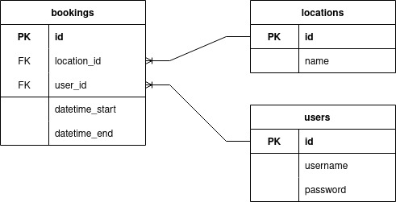

# Booking System API
## Description

A [Nest](https://github.com/nestjs/nest) backend application, that requires a MySQL database.


## Installation

```bash
$ npm install
```

## Configuration

Create an `.env` file in the project root by following and fill the values according to `.env.example`. 

An example can be found below:

```yml
# App
PORT=8080 # port which this project will run on

# Database 
DB_TYPE=mysql
DB_HOST=127.0.0.1
DB_PORT=3306
DB_USERNAME=username
DB_PASSWORD=password
DB_NAME=bookingsystem

# Auth
JWT_SECRET=secret # can be any string, used to sign JWT

```

## Running the app

```bash
# development
$ npm run start

# watch mode
$ npm run start:dev

# production mode
$ npm run start:prod
```


## Test

```bash
# unit tests
$ npm run test

# test coverage
$ npm run test:cov
```

----

## ERD



